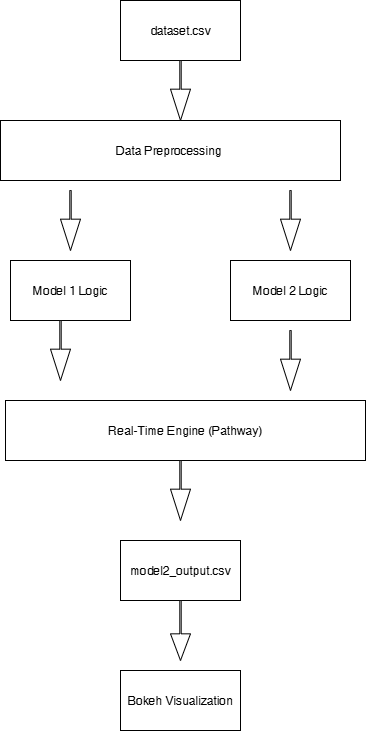

#  Dynamic Pricing for Urban Parking Lots

Capstone Project – Summer Analytics 2025  
Hosted by Consulting & Analytics Club × Pathway

##  Project Overview

This project implements real-time dynamic pricing for urban parking lots using data such as occupancy, traffic, queue length, and vehicle type.

We implemented:
- Model 1: Linear pricing based on occupancy
-  Model 2: Demand-based pricing
-  Model 3: Not implemented (as per scope)

## Tech Stack

- Python
- NumPy & Pandas
- Bokeh (Real-time visualization)
- Pathway (Real-time data streaming engine)
- Google Colab

## Pricing Models

**Model 1**:
P(t+1) = P(t) + α × (Occupancy / Capacity)

**Model 2**:
Demand = α·OccRate + β·Queue − γ·Traffic + δ·SpecialDay + ε·VehicleType  
Price = BasePrice × (1 + λ × NormalizedDemand)

## Architecture Flow

1. Input dataset from 14 parking lots  
2. Preprocessing vehicle & traffic weights  
3. Apply Model 1 & 2 logic  
4. Run pricing in real-time using Pathway  
5. Display graph using Bokeh

## Architecture Diagram

## Files Included

- `notebook.ipynb`: Colab notebook  
- `dataset.csv`: Input dataset  
- `model2_output.csv`: Pathway output  
- `README.md`: This file  
- `architecture.png`: System diagram

##  Run Instructions

1. Upload all files to Colab  
2. Run all cells in order  
3. Check final graph and `model2_output.csv` in sidebar
